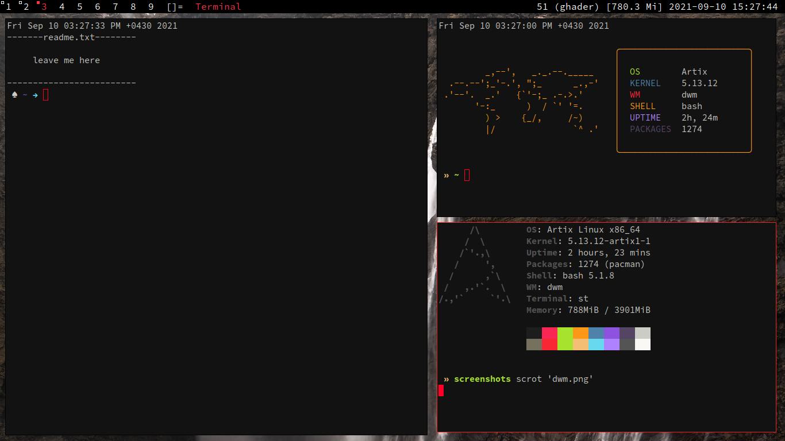
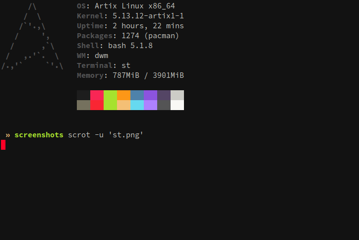
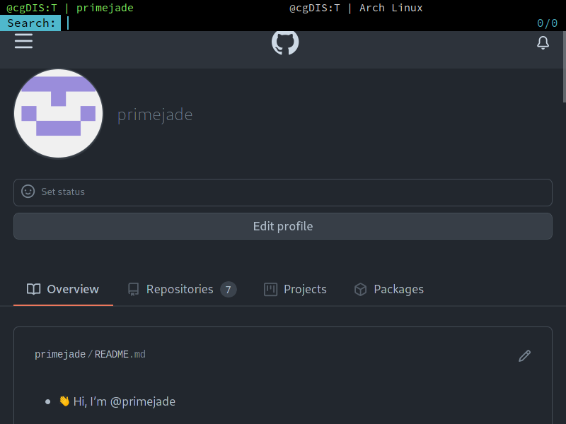

# suckless
My Build of some suckless tools

That includes:

- dmenu
- dwm
- slstatus
- st
- surf
- tabbed

## dmenu
applied patches:

- numbers
- highpriority

## dwm

you need to add dwm manually into your Display Manager,

to do this, you can copy `dwm.desktop` file to
`/usr/share/xsessions` directory

applied patches:

- autostart
- fullgaps

**_Some keybindings:_**

`Mod1Mask` is the default `Mod` key

`Mod + x`  execute `st` in floating mode

`Mod + Shift + x` execute `st` inside `tabbed`

`Mod + w` execute `surf` inside `tabbed`

*Screenshot:*
\
\

## st
applied patches:

- scrollback

*Screenshot:*
\
\

## surf
applied patches:

- aria2
- homepage

> `Control + Shift` key functionalities has changed to `Alt + Control`

*Screenshot:*
\
\

## tabbed
applied patches:

- keyrelease
- hidetabs
