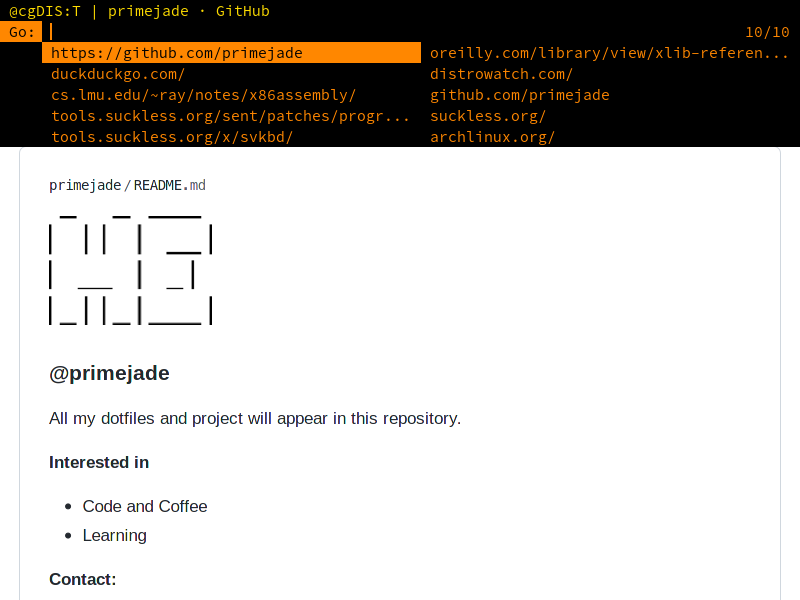

# suckless
My Build of some suckless tools

That includes

- dmenu
- dwm
- slstatus
- st
- surf
- tabbed
- slock

## dmenu
applied patches

- numbers
- highpriority
- grid

## dwm
you need to add dwm manually into your Display Manager,

to do this, you can copy `dwm.desktop` file to
`/usr/share/xsessions` directory

applied patches

- autostart
- fullgaps

**Some keybindings**

`Mod1Mask` (Alt) is the default `Mod` key

`Mod + x`  execute `st` in floating mode

`Mod + Shift + x` execute `st` inside `tabbed`

`Mod + w` execute `surf` inside `tabbed`

## st
applied patches

- scrollback

## surf
applied patches

- aria2
- homepage

## tabbed
applied patches

- keyrelease
- hidetabs

> `Control + Shift` key functionalities has changed to `Alt + Control`

## Screenshots

- dwm and slstatus

- surf, dmenu and tabbed

- st

